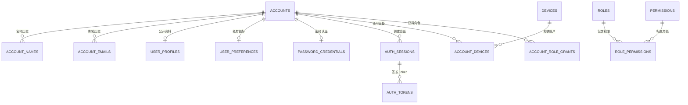
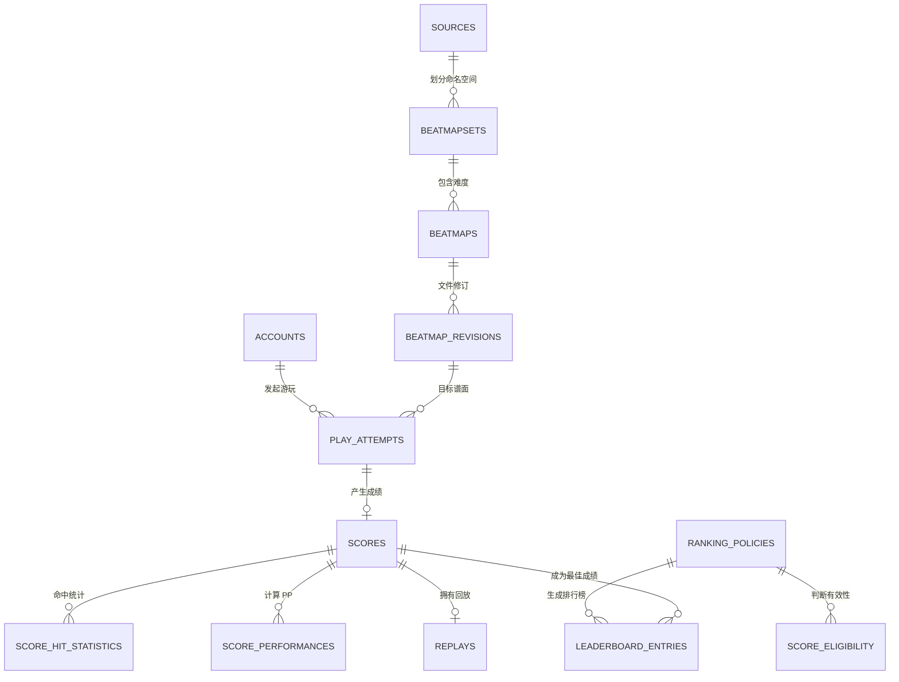
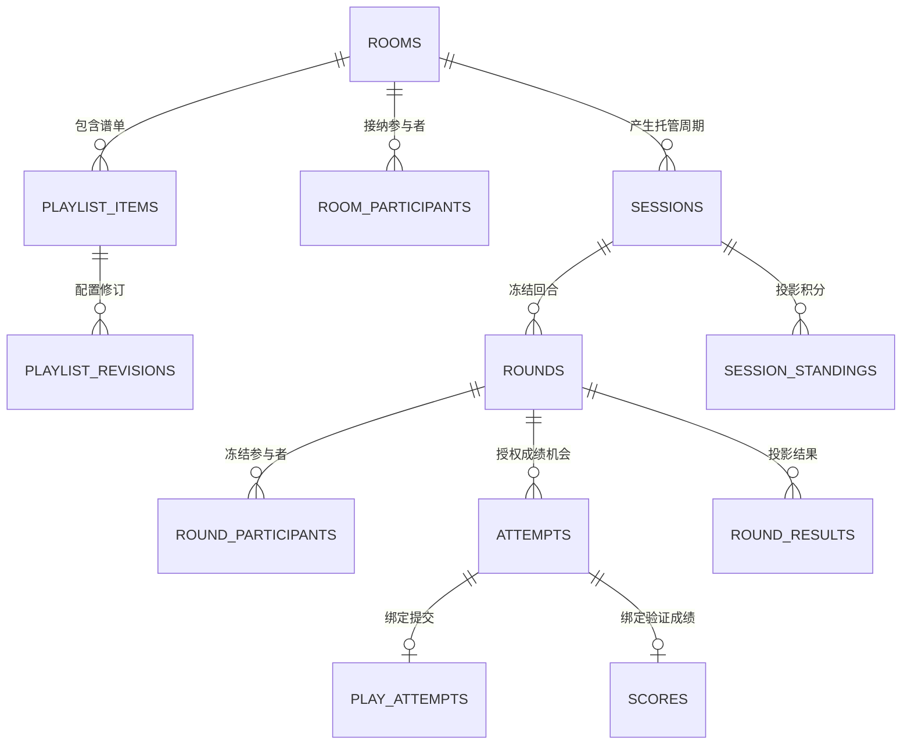
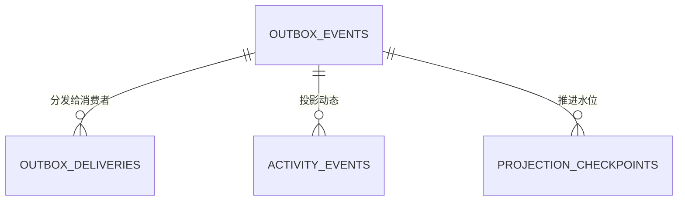
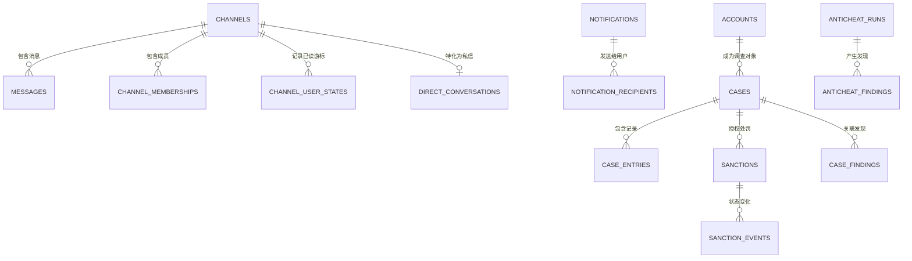

# 领域关系

下列图用于表达聚合边界，不展示全部审计边和投影边。列级结构以 SQLAlchemy Model 为准。

## 身份与授权

## 谱面与成绩

## 中心多人领域

当前连接、房间即时成员状态、Ready/Loading/Skip 与实时帧位于 Redis，不进入关系图。PostgreSQL 中的 Presence 只表示需要保留的加入和离开历史。

## 事件投递

Relay 从 `OUTBOX_DELIVERIES` 领取到期记录并投递 Taskiq。Worker 完成领域处理后，在同一 PostgreSQL 事务中更新投影、Checkpoint 和 Delivery。

## 社区与处罚

